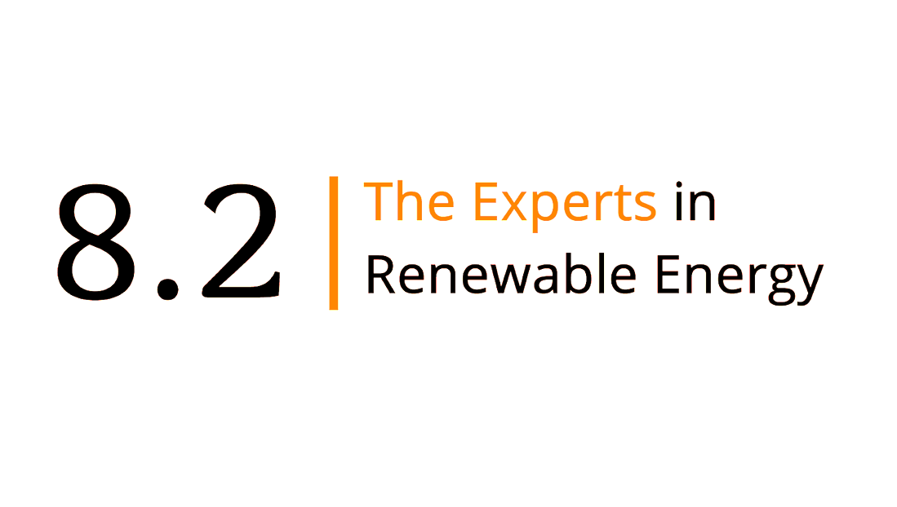

<!doctype html>
<html lang="pt-BR">
  <head>
    <meta charset="UTF-8" />
    <meta name="viewport" content="width=device-width, initial-scale=1.0" />
    <title>Gestão de Projetos</title>
    <link rel="stylesheet" href="styles.css" />
  </head>
  <body>
    

      <aside class="sidebar">
        

          
          

            <strong>Projetos</strong>
            Coordenação e execução
          

        

        <nav class="nav">
          <button class="nav-item active" data-view="portfolio" title="Projetos">
            ▦
            Projetos
          </button>
          <button class="nav-item" data-view="project" title="Projeto ativo">
            ☑
            Projeto ativo
          </button>
          <button class="nav-item" data-view="planning" title="Planejamento">
            ▥
            Planejamento
          </button>
        </nav>

        

          <label for="projectSelect">Projeto ativo</label>
          <select id="projectSelect"></select>
          <button class="ghost-button full" id="newProjectBtn">+ Novo projeto</button>
        

      </aside>

      <main class="workspace">
        <header class="topbar">
          

            
Carteira de projetos

            <h1 id="projectTitle">Projeto</h1>
            
Developed by: Gabriel Garcia

          

          

            <button class="ghost-button" id="exportBtn" title="Exportar dados">Exportar</button>
            <button class="primary-button" id="quickTaskBtn">+ Tarefa</button>
          

        </header>

        <section class="view active" id="portfolioView">
          

        </section>

        <section class="view" id="projectView">
          

            

              Progresso
              <strong id="metricProgress">0%</strong>
            

            

              Tarefas abertas
              <strong id="metricOpen">0</strong>
            

            

              Stand-by
              <strong id="metricRisk">0</strong>
            

            

              Próximo prazo
              <strong id="metricDeadline">-</strong>
            

          

          

            <section class="panel">
              

                <h2>Informações iniciais</h2>
                <button class="icon-button" id="editProjectBtn" title="Editar projeto">✎</button>
              

              <dl class="project-details" id="projectDetails"></dl>
              

                

                  <h3>Envolvidos no projeto</h3>
                

                

                

                  <input id="involvedInput" placeholder="Nome da pessoa" />
                  <button class="ghost-button" id="addInvolvedBtn" type="button">Adicionar</button>
                

              

            </section>

            <section class="panel">
              

                <h2>Próximas ações</h2>
                <button class="icon-button" id="splitTaskBtn" title="Dividir tarefa">⧉</button>
              

              

            </section>
          

          <section class="panel project-work-panel">
            

              

                <h2>Etapas do projeto</h2>
                
Escolha como quer visualizar e destrinchar as tarefas deste projeto.

              

              

                <button class="primary-button" id="addTaskBtn" title="Criar uma atividade com duração">+ Nova tarefa</button>
                <button class="ghost-button" id="addMilestoneBtn" title="Criar um ponto de controle sem duração">+ Marco</button>
              

            

            

              

                <button class="active" data-project-view="kanban">Kanban</button>
                <button data-project-view="list">Lista</button>
                <button data-project-view="gantt">Gantt</button>
              

              

                <button class="active" data-scale="day">Dia</button>
                <button data-scale="week">Semana</button>
              

              <select id="ownerFilter" title="Filtrar por responsável"></select>
              <select id="statusFilter" title="Filtrar por status">
                <option value="all">Todos os status</option>
                <option value="aprovado">Aprovado</option>
                <option value="afazer">A fazer</option>
                <option value="andamento">Em andamento</option>
                <option value="revisao">Revisão</option>
                <option value="standby">Stand-by</option>
                <option value="concluido">Concluído</option>
              </select>
            

            

              

            

            

              

            

            

              

                

              

            

          </section>
        </section>

        <section class="view" id="planningView">
          <section class="panel">
            

              

                <h2>Planejamento da equipe</h2>
                
Alocação automática baseada nos envolvidos e no período de cada projeto.

              

              

                <button class="active" data-planning-days="45">45 dias</button>
                <button data-planning-days="75">75 dias</button>
                <button data-planning-days="120">120 dias</button>
              

            

            

              

            

            

          </section>
        </section>
      </main>
    

    <dialog id="projectDialog">
      <form method="dialog" id="projectForm" class="modal-form">
        <h2>Projeto</h2>
        <label>Cliente <input name="name" required /></label>
        

          <label>Tipo de projeto
            <select name="projectType" id="projectTypeSelect">
              <option value="TQI">TQI</option>
              <option value="DD">DD</option>
              <option value="Arbitragem">Arbitragem</option>
              <option value="RCA">RCA</option>
              <option value="LTE">LTE</option>
              <option value="Outro">Outro</option>
            </select>
          </label>
          <label id="projectTypeOtherLabel" class="hidden-field">Qual tipo? <input name="projectTypeOther" placeholder="Descreva o tipo de projeto" /></label>
        

        <label>Descrição <textarea name="goal" rows="3" required></textarea></label>
        <section class="form-section">
          <h3>Entregáveis</h3>
          

          <label id="languageLabel" class="hidden-field">Idioma
            <select name="language">
              <option value="">Selecione</option>
              <option value="Português">Português</option>
              <option value="Espanhol">Espanhol</option>
              <option value="Inglês">Inglês</option>
            </select>
          </label>
          <label id="deliverableOtherLabel" class="hidden-field">Outro entregável <input name="deliverableOther" placeholder="Descreva o entregável" /></label>
        </section>
        

          <label class="project-manager-field">Responsável <input name="manager" /></label>
          <label>Envolvidos no projeto <textarea name="people" rows="3" placeholder="Uma pessoa por linha"></textarea></label>
          <label>Início <input name="start" type="date" required /></label>
          <label>Fim <input name="end" type="date" required /></label>
          <label>Prioridade
            <select name="priority">
              <option>Alta</option>
              <option>Média</option>
              <option>Baixa</option>
            </select>
          </label>
          <label>Status
            <select name="status">
              <option>Em andamento</option>
              <option>Planejamento</option>
              <option>Em risco</option>
              <option>Concluído</option>
            </select>
          </label>
        

        <menu>
          <button class="ghost-button" value="cancel" type="button" data-close>Cancelar</button>
          <button class="primary-button" value="default">Salvar</button>
        </menu>
      </form>
    </dialog>

    <dialog id="taskDialog">
      <form method="dialog" id="taskForm" class="modal-form task-detail-form">
        

          

            
Cartão do projeto

            <h2>Tarefa</h2>
          

          <button class="icon-button" value="cancel" type="button" data-close title="Fechar">×</button>
        

        <input type="hidden" name="id" />
        <input type="hidden" name="imageData" />
        <input type="hidden" name="isMilestone" value="false" />
        <label class="task-title-field">Título <input name="title" required /></label>
        

          <label>Responsável <input name="owner" required /></label>
          <label>Status
            <select name="status">
              <option value="aprovado">Aprovado</option>
              <option value="afazer">A fazer</option>
              <option value="andamento">Em andamento</option>
              <option value="revisao">Revisão</option>
              <option value="standby">Stand-by</option>
              <option value="concluido">Concluído</option>
            </select>
          </label>
          <label>Data inicial <input name="start" type="date" required /></label>
          <label>Data final <input name="end" type="date" required /></label>
          <label>Progresso
            
0%20%40%60%80%100%

            <input name="progress" type="range" min="0" max="100" step="5" />
          </label>
          <label>Dependência <select name="dependsOn"></select></label>
        

        

          <button class="ghost-button" type="button" data-focus-field="checklist">+ Checklist</button>
          <button class="ghost-button" type="button" data-focus-field="attachments">+ Anexo</button>
          <button class="ghost-button" type="button" data-focus-field="labels">+ Etiqueta</button>
          <button class="ghost-button" type="button" data-focus-field="imageInput">+ Imagem</button>
        

        <label class="span-2">Descrição da atividade <textarea name="description" rows="5" placeholder="Detalhe o escopo, critérios de aceite, entregáveis e observações importantes."></textarea></label>
        

          <label>Check-list <textarea name="checklist" rows="5" placeholder="Uma atividade por linha"></textarea></label>
          <label>Comentários <textarea name="comments" rows="5" placeholder="Registre decisões, dúvidas e alinhamentos"></textarea></label>
          <label>Etiquetas <input name="labels" placeholder="Ex.: 2026, urgente, cliente" /></label>
          <label>Anexo <input name="attachments" type="file" multiple /></label>
          <label class="span-2">Imagem <input id="imageInput" name="imageInput" type="file" accept="image/*" /></label>
        

        

        <menu>
          <button class="danger-button" type="button" id="deleteTaskBtn">Excluir</button>
          
          <button class="ghost-button" value="cancel" type="button" data-close>Cancelar</button>
          <button class="primary-button" value="default">Salvar</button>
        </menu>
      </form>
    </dialog>

    <dialog id="splitDialog">
      <form method="dialog" id="splitForm" class="modal-form">
        <h2>Dividir tarefa</h2>
        <label>Tarefa base <select name="taskId" required></select></label>
        <label>Subtarefas <textarea name="items" rows="6" required placeholder="Uma subtarefa por linha"></textarea></label>
        <menu>
          <button class="ghost-button" value="cancel" type="button" data-close>Cancelar</button>
          <button class="primary-button" value="default">Criar subtarefas</button>
        </menu>
      </form>
    </dialog>

    
  </body>
</html>
